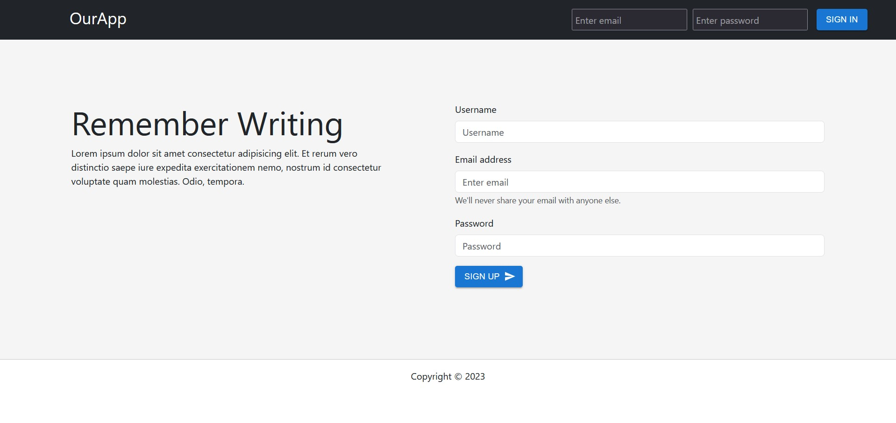

# Social Media App Project(ONGOING)

 <!-- Replace with your project logo or relevant image -->

## Description

This ongoing Social Media App Project is a platform that allows users to connect, share posts, follow other users, and engage in real-time chat. This app aims to provide a seamless and user-friendly social networking experience for users to interact and stay connected.

## Features

- User registration and authentication.
- Creating, editing, and deleting posts.
- Following and unfollowing other users.
- Real-time chat functionality for private conversations[To be done].
- News feed displaying posts from followed users.
- Notifications for new followers.
- Search functionality to discover other users.

## Technologies Used

- Frontend: HTML, SaSS, JavaScript (React)
- User Interface: Material UI, React Bootstrap
- Backend: Node.js, Express.js
- Database: MongoDB 
- Real-time Communication: Socket.io
- User Authentication: JSON Web Tokens (JWT)

## Getting Started

1. Clone the repository: `git clone https://github.com/your-username/social-media-app.git`
2. Install frontend dependencies: `cd frontend && npm install`
3. Install backend dependencies: `cd backend && npm install`
4. Set up your database connection and environment variables.
5. Start the frontend and backend servers: `npm start` or `npm run dev` for development.
6. Access the app in your browser at `http://localhost:3000`.

## Screenshots

## Future Enhancements

- Like and comment functionality on posts.
- User profile customization options.
- Explore page to discover trending posts and users.
- Improved chat features such as group chats.
- Mobile app version for better accessibility.
- User profiles with profile pictures and bio.

